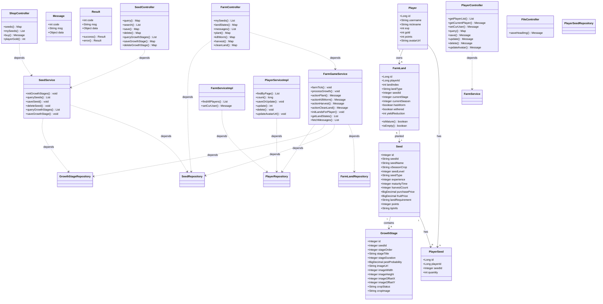

# 图1：农场种植管理系统核心类图

```mermaid
classDiagram
    direction TB

    class Seed {
        +Integer id
        +String seedId
        +String seedName
        +String xSeasonCrop
        +Integer seedLevel
        +String seedType
        +Integer experience
        +Integer maturityTime
        +Integer harvestCount
        +BigDecimal purchasePrice
        +BigDecimal fruitPrice
        +String landRequirement
        +Integer points
        +String tipInfo
    }

    class Player {
        +Long id
        +String username
        +String nickname
        +int exp
        +int gold
        +int points
        +String avatarUrl
    }

    class PlayerSeed {
        +Long id
        +Long playerId
        +Integer seedId
        +int quantity
    }

    class GrowthStage {
        +Integer id
        +Integer seedId
        +Integer stageOrder
        +String stageTitle
        +Integer stageDuration
        +BigDecimal pestProbability
        +String imageUrl
        +Integer imageWidth
        +Integer imageHeight
        +Integer imageOffsetX
        +Integer imageOffsetY
        +String cropStatus
        +String cropImage
    }

    class FarmLand {
        +Long id
        +Long playerId
        +int landIndex
        +String landType
        +Integer seedId
        +Integer currentStage
        +Integer currentSeason
        +boolean hasWorm
        +boolean withered
        +int yieldReduction
        +isMature() boolean
        +isEmpty() boolean
    }

    class Message {
        +int code
        +String msg
        +Object data
    }

    class Result {
        +int code
        +String msg
        +Object data
        +success() Result
        +error() Result
    }

    class FarmController {
        +mySeeds() List
        +landStates() Map
        +messages() List
        +plant() Map
        +killWorm() Map
        +harvest() Map
        +cleanLand() Map
    }

    class SeedController {
        +query() Map
        +search() List
        +save() Map
        +delete() Map
        +queryGrowthStages() List
        +saveGrowthStage() Map
        +deleteGrowthStage() Map
    }

    class ShopController {
        +seeds() Map
        +mySeeds() List
        +buy() Message
        +playerGold() int
    }

    class PlayerController {
        +getPlayerList() List
        +getCurrentPlayer() Message
        +setCurUser() Message
        +query() Map
        +save() Message
        +update() Message
        +delete() Message
        +updateAvatar() Message
    }

    class FileController {
        +saveHeadImg() Message
    }

    class FarmGameService {
        +farmTick() void
        +processGrowth() void
        +actionPlant() Message
        +actionKillWorm() Message
        +actionHarvest() Message
        +actionCleanLand() Message
        +initLandsForPlayer() void
        +getLandStates() List
        +fetchMessages() List
    }

    class FarmServiceImpl {
        +findAllPlayers() List
        +setCurUser() Message
    }

    class PlayerServiceImpl {
        +findByPage() List
        +count() long
        +saveOrUpdate() void
        +update() int
        +delete() void
        +updateAvatarUrl() void
    }

    class SeedService {
        +initGrowthStages() void
        +querySeeds() List
        +saveSeed() void
        +deleteSeed() void
        +queryGrowthStages() List
        +saveGrowthStage() void
    }

    class SeedRepository
    class PlayerRepository
    class PlayerSeedRepository
    class GrowthStageRepository
    class FarmLandRepository

    Player "1" --> "N" PlayerSeed : has
    Seed "1" --> "N" PlayerSeed : has
    Player "1" --> "N" FarmLand : owns
    FarmLand "N" --> "1" Seed : planted
    Seed "1" --> "N" GrowthStage : contains

    FarmController ..> FarmGameService : depends
    FarmController ..> SeedRepository : depends
    SeedController ..> SeedService : depends
    ShopController ..> SeedService : depends
    PlayerController ..> FarmService : depends

    FarmGameService ..> FarmLandRepository : depends
    FarmGameService ..> SeedRepository : depends
    FarmGameService ..> GrowthStageRepository : depends
    FarmGameService ..> PlayerRepository : depends
    FarmServiceImpl ..> PlayerRepository : depends
    PlayerServiceImpl ..> PlayerRepository : depends
    SeedService ..> SeedRepository : depends
    SeedService ..> GrowthStageRepository : depends
```
